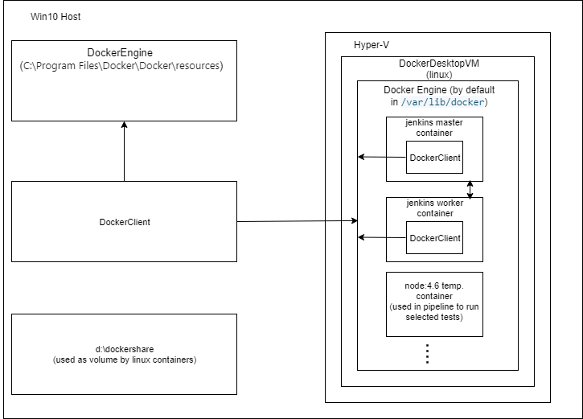

- [install jenkins using docker](#install-jenkins-using-docker)
- [review amd use demo application](#review-amd-use-demo-application)
  - [install nodejs plugin in Jenkins](#install-nodejs-plugin-in-jenkins)
  - [create first jenkins job and configure it manually](#create-first-jenkins-job-and-configure-it-manually)
  - [Run the job](#run-the-job)
- [Use docker to build nodejs app](#use-docker-to-build-nodejs-app)
  - [Install docker plugin on jenkins](#install-docker-plugin-on-jenkins)
  - [Add docker client to the jenkins image](#add-docker-client-to-the-jenkins-image)
    - [Create new image that contains also docker client](#create-new-image-that-contains-also-docker-client)
    - [Run container from the new image](#run-container-from-the-new-image)
    - [Connect to the new container as root and check if docker client is connected to the docker engine.](#connect-to-the-new-container-as-root-and-check-if-docker-client-is-connected-to-the-docker-engine)
    - [Connect to the new container as jenkins user and check of docker client is connected to the docker engine.](#connect-to-the-new-container-as-jenkins-user-and-check-of-docker-client-is-connected-to-the-docker-engine)
  - [Create docker image as build output](#create-docker-image-as-build-output)
    - [Add new build step: docker build and publish](#add-new-build-step-docker-build-and-publish)
    - [Create new repo in docker hub](#create-new-repo-in-docker-hub)
    - [Configure the new step](#configure-the-new-step)
    - [Remove not needed step](#remove-not-needed-step)
    - [Run the job to build and publish the image](#run-the-job-to-build-and-publish-the-image)
    - [Pull and run created image](#pull-and-run-created-image)
- [Infrastructure as a code](#infrastructure-as-a-code)
  - [Jenkins Job DSL (Domain Specific Language)](#jenkins-job-dsl-domain-specific-language)
    - [Install DSL plugin](#install-dsl-plugin)
    - [Create new DSL job](#create-new-dsl-job)
    - [Configure DSL job](#configure-dsl-job)
    - [Run the job](#run-the-job-1)
  - [DSL job that builds and publishes docker image](#dsl-job-that-builds-and-publishes-docker-image)
  - [Jenkins Pipelines](#jenkins-pipelines)
    - [Jenkins pipelines vs DSL jobs](#jenkins-pipelines-vs-dsl-jobs)
    - [Jenkins pipeline with NodeJs and Docker](#jenkins-pipeline-with-nodejs-and-docker)
      - [Install docker pipeline plugin](#install-docker-pipeline-plugin)
      - [Create new pipeline job](#create-new-pipeline-job)
      - [Configure pipeline job](#configure-pipeline-job)
    - [Build, test and run everything is docker containers](#build-test-and-run-everything-is-docker-containers)
      - [Create new job](#create-new-job)
      - [Configure the job](#configure-the-job)
- [Jenkins slaves](#jenkins-slaves)
  - [Static/manual scaling](#staticmanual-scaling)
  - [Dynamic worker scaling](#dynamic-worker-scaling)
  - [Slave and master integration](#slave-and-master-integration)
    - [Create Jenkins Slave using JNLP/docker](#create-jenkins-slave-using-jnlpdocker)
      - [Create new node](#create-new-node)
      - [Create image for the Jenkins Slave](#create-image-for-the-jenkins-slave)
      - [Run container that will be used as Jenkins Slave](#run-container-that-will-be-used-as-jenkins-slave)
      - [Check jenkins master container IP address](#check-jenkins-master-container-ip-address)
      - [Set Jenkins URI in Jenkins configuration](#set-jenkins-uri-in-jenkins-configuration)
      - [In the slave node view check how to download **agent.jar**.](#in-the-slave-node-view-check-how-to-download-agentjar)
      - [Download **agent.jar**](#download-agentjar)
      - [Run **agent.jar** to connect wit the master](#run-agentjar-to-connect-wit-the-master)
      - [Check on the master if the salve is enabled](#check-on-the-master-if-the-salve-is-enabled)
      - [Run a job on the slave](#run-a-job-on-the-slave)
    - [Create Jenkins Slave using cloud/docker](#create-jenkins-slave-using-clouddocker)
      - [Install docker plugin](#install-docker-plugin)
      - [Add new cloud - docker](#add-new-cloud---docker)
      - [Configure jenkins node cloud docker](#configure-jenkins-node-cloud-docker)
      - [Create and run job that will be executed by this jenkins node (slave)](#create-and-run-job-that-will-be-executed-by-this-jenkins-node-slave)
- [Diagram](#diagram)
- [resources](#resources)

# install jenkins using docker

It looks that now this is official image for Jenkins: https://www.jenkins.io/blog/2018/12/10/the-official-Docker-image/

```
docker run --name jenkins-docker -p 8777:8080 -p 50000:50000 -v D:\dockershare\jenkins_home:/var/jenkins_home jenkins/jenkins:lts
```
* After installation add all default plugins.
* Create admin user and click on the form **Save and Continue**. (admin/kicaj)

At this point in time the lts image contained **Jenkins 2.249.1**.

# review amd use demo application

It is simple nodejs application.

## install nodejs plugin in Jenkins

Manage Jenkins -> Manage Plugins -> Available -> type in search ```nodejs``` -> select from the list NodeJs plugin -> click 'Download now and install after restart'.


[pluing page](https://plugins.jenkins.io/nodejs/)

**This will NOTE install nodejs application on the jenkins host** but it will allow to install it later.

After installation the plugin should be on the list of installed plugins.


## create first jenkins job and configure it manually

Create `nodejs example app` as `freestyle project`.   

1. Define link to git repository.

2. Add build step to execute shell command.


3. Save jenkins job configuration.
4. Install nodejs   
   Manage Jenkins -> Global Tool Configuration

   >NOTE: it will be installed in folder ```jenkins_home\tools\jenkins.plugins.nodejs.tools.NodeJSInstallation\nodejs```.
5. Go back to the job configuration to point installed nodejs


## Run the job
The job now can successfully download all needed npm packages.

All job output is available in mounted folder: `D:\dockershare\jenkins_home\workspace\nodejs example app`.

```ps
PS D:\dockershare\jenkins_home\workspace\nodejs example app\> npm start

> myapp@0.0.1 start D:\dockershare\jenkins_home\workspace\nodejs example app\
> node index.js

Example app listening at http://:::3000
```

# Use docker to build nodejs app

## Install docker plugin on jenkins
Manage Jenkins -> Manage Plugins -> Available -> type docker in search input. Click **Download now and install after restart**.


## Add docker client to the jenkins image

Because jenkins is already running in docker container we need to make sure that this jenkins container can access docker socket which is in linux system a file that can be used to communicate with docker api. Basically we need to make sure that docker client works correctly in the in the jenkins container - it means it can connect with docker engine. More [here](https://stackoverflow.com/questions/35110146/can-anyone-explain-docker-sock/35110344#:~:text=130-,docker.,defaults%20to%20use%20UNIX%20socket.&text=There%20might%20be%20different%20reasons,Docker%20socket%20inside%20a%20container.).

### Create new image that contains also docker client

>NOTE: To check docker group ID run ```cat /etc/group | grep docker``` or alternatively ```getent group docker``` in docker engine host (or client??? I am not sure). **After some testing it looks that this ID can be any not used group ID at least in combination Win10 and Linux Container!**.

```ps
PS D:\GitHub\kicaj29\jenkins-pipelines\jenkins-docker> docker build -t jenkins-docker:ver1 .
Sending build context to Docker daemon  2.048kB
Step 1/4 : FROM jenkins/jenkins:lts
 ---> 190554e5446b
Step 2/4 : USER root
 ---> Running in d1bbcda974b3
Removing intermediate container d1bbcda974b3
 ---> 62c4070a94b7
Step 3/4 : RUN mkdir -p /tmp/download &&  curl -L https://download.docker.com/linux/static/stable/x86_64/docker-18.03.1-ce.tgz | tar -xz -C /tmp/download &&  rm -rf /tmp/download/docker/dockerd &&  mv /tmp/download/docker/docker* /usr/local/bin/ &&  rm -rf /tmp/download &&  groupadd -g 106 docker &&  usermod -aG staff,docker jenkins
 ---> Running in 9ac716a7ee59
  % Total    % Received % Xferd  Average Speed   Time    Time     Time  Current
                                 Dload  Upload   Total   Spent    Left  Speed
100 36.9M  100 36.9M    0     0  8777k      0  0:00:04  0:00:04 --:--:-- 8779k
Removing intermediate container 9ac716a7ee59
 ---> 85ad9aca58cd
Step 4/4 : USER jenkins
 ---> Running in 320d8c8600c3
Removing intermediate container 320d8c8600c3
 ---> df06b72d3428
Successfully built df06b72d3428
Successfully tagged jenkins-docker:ver1
SECURITY WARNING: You are building a Docker image from Windows against a non-Windows Docker host. All files and directories added to build context will have '-rwxr-xr-x' permissions. It is recommended to double check and reset permissions for sensitive files and directories.
```

Next we can stop and remove previous container with jenkins and run new container from the new image.

### Run container from the new image

```
PS D:\GitHub\kicaj29\jenkins-pipelines\jenkins-docker> docker run -p 8777:8080 -p 50000:50000 -v D:\dockershare\jenkins_home:/var/jenkins_home -v /var/run/docker.sock:/var/run/docker.sock --name jenkins-docker -u jenkins jenkins-docker:ver1
```
>NOTE: [here](https://nagachiang.github.io/docker-bind-to-docker-socket-on-windows-host-from-linux-containers/#) is information to map socket in this way ```docker run -v //var/run/docker.sock:/var/run/docker.sock ...``` (double slash at the beginning and this version also works fine).

>NOTE1: it is important to run ```docker run``` as jenkins user (```-u jenkins```). Without this jenkins user will not have permission to ```docker.sock``` socket. This was the case in scenario Win10 host and DockerDesktopVM.

### Connect to the new container as root and check if docker client is connected to the docker engine.
```
PS D:\> docker exec -it -u root jenkins-docker bash
root@6df5f0604e38:/# docker ps
```
You can run also ```docker version``` in Windows 10 and in the container to see if information about docker engine is exactly the same.

We can also check permissions:
```
root@17907514d865:/# ls -ahl /var/run/docker.sock
srw-rw---- 1 root docker 0 Sep 28 04:59 /var/run/docker.sock
```

### Connect to the new container as jenkins user and check of docker client is connected to the docker engine.

```
PS D:\> docker exec -it jenkins-docker bash
jenkins@17907514d865:/$ docker ps
```

## Create docker image as build output

### Add new build step: docker build and publish


### Create new repo in docker hub


### Configure the new step


### Remove not needed step

Because now npm install is executed in [dockerfile](./Dockerfile) we can delete step create [earlier](#create-first-jenkins-job-and-configure-it-manually) (step that was doing also ```npm install```).

### Run the job to build and publish the image

After run the image should be available in docker hub.


### Pull and run created image

```ps
PS D:\> docker run -p 3001:3000 -d --name my-nodejs-app kicaj29/hello-world-image:latest
b2de148fdea652c4c1f02763896c470ba7e9f0f54d75481fdf628ef49deca801
PS D:\> docker ps | sls hello-world-image

b2de148fdea6        kicaj29/hello-world-image:latest   "docker-entrypoint.s…"   36 seconds ago      Up 35 seconds
      0.0.0.0:3001->3000/tcp                             my-nodejs-app
```

Next we can open the app in web browser:


# Infrastructure as a code

Issues when not using IaC:
* no proper audit trail
* no easy history of changes
* segregation between Jenkins admins and developers
  * users (often developers) will have to contact a Jenkins administrator to make a changes
  * Long lead times for changes
* Difficult to backup and restore (e.g. how to restore just one setting to how it was the day before)

All the above problems do not appear when using IaC.

## Jenkins Job DSL (Domain Specific Language)

DSL is a jenkins plugin that allows you to defined jobs in a programmatic form. You can describe jobs using **Groovy** based language.

### Install DSL plugin

Manage Jenkins -> Manage Plugins


### Create new DSL job

Select freestyle project job type.


### Configure DSL job

Define repo:


Create new build step:   


Configure the step:


### Run the job

For the first run it will fail:   


We have to approve the script: Manage Jenkins -> In-process Script Approval -> click Approve   


Run the job again, now it will be successful:   


It will create new job called **NodeJS example**:


Job **NodeJS example** is ready to use.

## DSL job that builds and publishes docker image

1. In existing **seed project** add path to the new groovy file:

    

2. Define credentials for ID **dockerhub**:

    Manage Jenkins -> Manage Credentials:

    

    

3. Approve the new groovy script (Manage Jenkins -> In-process Script Approval -> click Approve)

4. Run the **seed project** - it will create new jenkins job **NodeJS Docker example**.
   
5. Run created job **NodeJS Docker example**. It should build and publish new image to the configured repository in docker hub.   
   

6. Next you can run it using the following command:
    ```
    PS D:\> docker run -p 3001:3000 -d --name my-nodejs-app kicaj29/hello-world-image:9dedd7b65
    2ec7eac034007d52c20372e921c5b1e0dab0d11a0b0c9539561e50fbff2ea9b5
    ```

## Jenkins Pipelines

### Jenkins pipelines vs DSL jobs

* The both have the capability to write all you CI/CD in code
* The difference is in implementation in Jenkins
* DSL job creates a new jobs based on the code you write
* The Jenkins Pipelines is a job type, you can create a Jenkins pipeline job that will handle the build/test/deployment of one project
* **It is possible to create DSL jobs to create new pipeline jobs**. Another possibility would be to use an **Organization folder**, which is a feature of Jenkins Pipelines to detect the project repositories, removing the need to add new jobs.

### Jenkins pipeline with NodeJs and Docker

#### Install docker pipeline plugin


#### Create new pipeline job


#### Configure pipeline job


>NOTE: click label **Pipeline Syntax** (on the bottom of the screen )to navigate to view where many jenkinsfile snippets can be found.

### Build, test and run everything is docker containers

The idea is:
1. You can build/test your application first with and existing container with all the development tools.
2. Next you can build a new container. much tinier, with only the runtime environment.
3. Spinning up a new docker containers lets you bring in any new tool easily:
    * You can specify exactly what dependencies you want, at any stage in the job
    * You can start a database during the test stage to run tests on
    * After the database tests have been concluded, the container can be removed, together with all the data

[Jenkins.v2](./Jenkins.v2)

#### Create new job


#### Configure the job


Next we can run the job to check if it works correctly.

# Jenkins slaves

## Static/manual scaling

* You can have more workers during working hours (or no workers outside working hours)
* You can add more workers ad-hoc, when necessary
  * During periods when a lot of code is created
  * During periods when developers have to wait long for their builds to be finished
    * i.e. jobs stay a long time in the queue

## Dynamic worker scaling

* Dynamic worker scaling
  * You have plugins that can scale Jenkins slaves for you
    * **Amazon EC2 Plugin**: if your jenkins build cluster gets overloaded, the plugin will start new slave nodes automatically using the AWS EC2 API. If after some time the nodes are idle, they will automatically get killed.
    * **Docker plugin**: this plugin uses a docker host to spin up a slave container, run a jenkins build in it, and tear it down.
    * **Amazon ECS Plugin**: same as docker plugin, but the host is now a docker orchestrator, the EC2 Container Engine, which can host the docker containers and scale out when necessary.
    * **DigitalOcean Plugin**: dynamically provisions droplets to be used as jenkins slaves.

## Slave and master integration

* Master node connects to slave over SSH
* Slave node connects to master over JNLP
  * The slave will initiate the contact (useful if the slave is behind a firewall)
  * Good solution for windows slaves

### Create Jenkins Slave using JNLP/docker

#### Create new node

Jenkins -> Manage Jenkins -> Manage Nodes and Clouds -> New Node


#### Create image for the Jenkins Slave
```PS
D:\GitHub\kicaj29\jenkins-pipelines\jenkins-slave-docker> docker build -t jenkins-docker-slave:ver1 .
```

#### Run container that will be used as Jenkins Slave

```PS
docker run -it --name myjenkins-slave -v /var/run/docker.sock:/var/run/docker.sock jenkins-docker-slave:ver1
```

You can check java version using command
```
root@1722a983be11:/# java -version
openjdk version "1.8.0_265"
OpenJDK Runtime Environment (build 1.8.0_265-b01)
OpenJDK 64-Bit Server VM (build 25.265-b01, mixed mode)
root@1722a983be11:/#
```

>NOTE: to have easy access to all files created by this jenkins agent you can mount the jenkins folder in local file system:
```PS
docker run -it --name myjenkins-slave-mounted -v /var/run/docker.sock:/var/run/docker.sock -v D:\dockershare\jenkins_home_builder_node_mounted:/var/jenkins_home jenkins-docker-slave:ver1
```

#### Check jenkins master container IP address

Because slave container will communicate with master container we have to know IP address of the master container.

```
PS D:\> docker inspect -f '{{range .NetworkSettings.Networks}}{{.IPAddress}}{{end}}' jenkins-docker
172.17.0.2
```

#### Set Jenkins URI in Jenkins configuration

Jenkins -> Manage Jenkins -> Configure System


Thx to this correct IP address will be used in generated **agent.jar** used by slave to communicate with the master.

#### In the slave node view check how to download **agent.jar**.


#### Download **agent.jar**

In jenkins slave download **agent.jar**. Use IP address and port of the master jenkins container and not localhost!

```
root@25d02a9e409a:/# wget http://172.17.0.2:8080/jnlpJars/agent.jar
--2020-10-06 14:29:05--  http://172.17.0.2:8080/jnlpJars/agent.jar
Connecting to 172.17.0.2:8080... connected.
HTTP request sent, awaiting response... 200 OK
Length: 1521553 (1.5M) [application/java-archive]
Saving to: ‘agent.jar’

agent.jar                     100%[================================================>]   1.45M
--.-KB/s    in 0.01s

2020-10-06 14:29:05 (113 MB/s) - ‘agent.jar’ saved [1521553/1521553]
```

#### Run **agent.jar** to connect wit the master

```
root@25d02a9e409a:/# java -jar agent.jar -jnlpUrl http://172.17.0.2:8080/computer/builder-node/slave-agent.jnlp -secret 7dfa98ac38336c6a2f0e4d2ca8de5f2a29f65efecca0cca8cf4f807847baa677 -workDir "/var/jenkins"
Oct 06, 2020 2:29:16 PM org.jenkinsci.remoting.engine.WorkDirManager initializeWorkDir
INFO: Using /var/jenkins/remoting as a remoting work directory
Oct 06, 2020 2:29:16 PM org.jenkinsci.remoting.engine.WorkDirManager setupLogging
INFO: Both error and output logs will be printed to /var/jenkins/remoting
Oct 06, 2020 2:29:16 PM hudson.remoting.jnlp.Main createEngine
INFO: Setting up agent: builder-node
Oct 06, 2020 2:29:16 PM hudson.remoting.jnlp.Main$CuiListener <init>
INFO: Jenkins agent is running in headless mode.
Oct 06, 2020 2:29:16 PM hudson.remoting.Engine startEngine
INFO: Using Remoting version: 4.5
Oct 06, 2020 2:29:16 PM org.jenkinsci.remoting.engine.WorkDirManager initializeWorkDir
INFO: Using /var/jenkins/remoting as a remoting work directory
Oct 06, 2020 2:29:16 PM hudson.remoting.jnlp.Main$CuiListener status
INFO: Locating server among [http://172.17.0.2:8080/]
Oct 06, 2020 2:29:17 PM org.jenkinsci.remoting.engine.JnlpAgentEndpointResolver resolve
INFO: Remoting server accepts the following protocols: [JNLP4-connect, Ping]
Oct 06, 2020 2:29:17 PM hudson.remoting.jnlp.Main$CuiListener status
INFO: Agent discovery successful
  Agent address: 172.17.0.2
  Agent port:    50000
  Identity:      6f:0e:3c:9c:20:3f:54:52:7d:d7:c3:3e:ea:1d:d1:fe
Oct 06, 2020 2:29:17 PM hudson.remoting.jnlp.Main$CuiListener status
INFO: Handshaking
Oct 06, 2020 2:29:17 PM hudson.remoting.jnlp.Main$CuiListener status
INFO: Connecting to 172.17.0.2:50000
Oct 06, 2020 2:29:17 PM hudson.remoting.jnlp.Main$CuiListener status
INFO: Trying protocol: JNLP4-connect
Oct 06, 2020 2:29:17 PM hudson.remoting.jnlp.Main$CuiListener status
INFO: Remote identity confirmed: 6f:0e:3c:9c:20:3f:54:52:7d:d7:c3:3e:ea:1d:d1:fe
Oct 06, 2020 2:29:18 PM hudson.remoting.jnlp.Main$CuiListener status
INFO: Connected
```

#### Check on the master if the salve is enabled


#### Run a job on the slave


### Create Jenkins Slave using cloud/docker

Although it has in the name cloud this option also can be used to run everything locally.

#### Install docker plugin


#### Add new cloud - docker

Jenkins -> Manage Jenkins -> Manage Nodes and Clouds -> Configure Clouds


#### Configure jenkins node cloud docker

Docker configuration:


>NOTE: use ```unix:///var/run/docker.sock``` in Docker Host URI because our jenkins master runs in container and docker engine is installed on Windows 10 so dedicated VM ```DockerDesktopVM``` is used to talk with docker engine.

Docker Agent template configuration:


#### Create and run job that will be executed by this jenkins node (slave)


For job execution the new container with agent will be created and after some time it will be disabled and removed (if no one uses this job).


# Diagram



# resources
https://github.com/wardviaene/jenkins-course   
https://github.com/wardviaene/docker-demo   
https://www.udemy.com/course/learn-devops-ci-cd-with-jenkins-using-pipelines-and-docker/   
https://github.com/wardviaene/jenkins-docker   
http://jenkinsci.github.io/job-dsl-plugin/   
https://www.jenkins.io/doc/book/pipeline/   
[node(scripted) vs pipeline(declarative)1](https://www.blazemeter.com/blog/how-to-use-the-jenkins-scripted-pipeline)   
[node(scripted) vs pipeline(declarative)2](https://www.blazemeter.com/blog/how-to-use-the-jenkins-declarative-pipeline?utm_source=blog&utm_medium=BM_blog&utm_campaign=how-to-use-the-jenkins-scripted-pipeline)   
https://www.jenkins.io/doc/book/pipeline/syntax/#declarative-pipeline   
https://devopscube.com/docker-containers-as-build-slaves-jenkins/   
https://github.com/jenkinsci/docker-plugin/issues/599   
https://docs.microsoft.com/en-us/virtualization/windowscontainers/deploy-containers/linux-containers