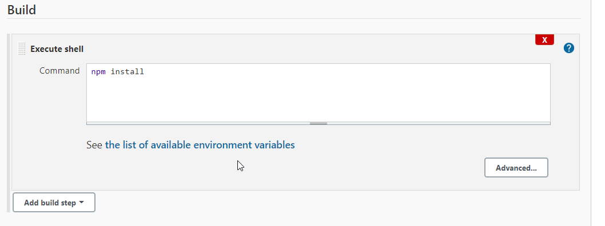

# install jenkins using docker

It looks that now this is official image for Jenkins: https://www.jenkins.io/blog/2018/12/10/the-official-Docker-image/

```
docker run --name myjenkins -p 8777:8080 -p 50000:50000 -v D:\dockershare\jenkins_home:/var/jenkins_home jenkins/jenkins:lts
```
* After installation add all default plugins.
* Create admin user and click on the form **Save and Continue**.

At this point in time the lts image contained **Jenkins 2.249.1**.

# review demo application

It is simple nodejs application.

[app-sources](./app-sources)

## install nodejs plugin in Jenkins

Manage Jenkins -> Manage Plugins -> Available -> type in search ```nodejs``` -> select from the list NodeJs plugin -> click 'Download now and install after restart'.


[pluing page](https://plugins.jenkins.io/nodejs/)

**This will NOTE install nodejs application on the jenkins host** but it will allow to install it later.

After installation the plugin should be on the list of installed plugins.


## create first jenkins job and configure it manually

Create `nodejs example app` as `freestyle project`.   

1. Define link to git repository.

2. Add build step to execute shell command.


3. Save jenkins job configuration.
4. Install nodejs   
   Manage Jenkins -> Global Tool Configuration

5. Go back to the job configuration to point installed nodejs


## Run the job
The job now can successfully download all needed npm packages.

All job output is available in mounted folder: `D:\dockershare\jenkins_home\workspace\nodejs example app`.

```ps
PS D:\dockershare\jenkins_home\workspace\nodejs example app\app-sources> npm start

> myapp@0.0.1 start D:\dockershare\jenkins_home\workspace\nodejs example app\app-sources
> node index.js

Example app listening at http://:::3000
```

# resources
https://github.com/wardviaene/jenkins-course
https://github.com/wardviaene/docker-demo
https://www.udemy.com/course/learn-devops-ci-cd-with-jenkins-using-pipelines-and-docker/